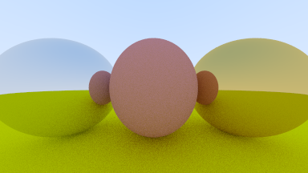

# Ray Tracing in One Weekend (in Rust)

[Ray Tracing in One Weekend](https://raytracing.github.io/books/RayTracingInOneWeekend.html) in Rust

There's also a version [in Julia](https://github.com/shritesh/raytrace) and [Roc](https://github.com/shritesh/raytrace.roc).
